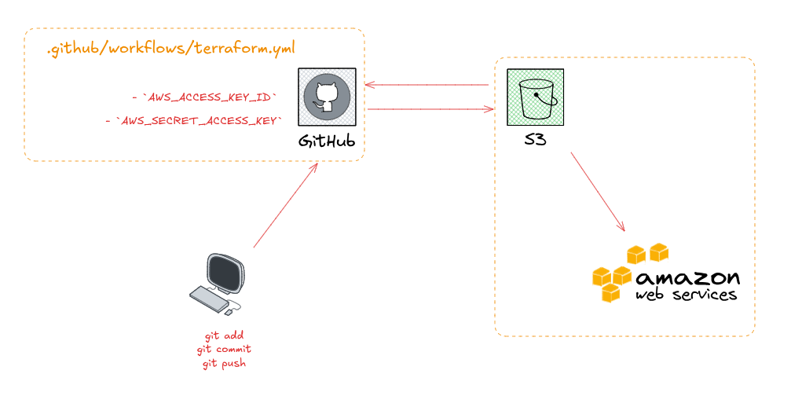

# 🚀 Terraform AWS S3 Deployment with GitHub Actions 
 - This project is terraform AWS s3 deployment with Github Actions ,store code on github and store terraform state in AWS s3.

📸 Architecture Overview




   
# 🚀 Store Terraform state in AWS S3 
- Terraform uses a backend to store state remotely. For AWS, that’s S3
  
#  Store code in GitHub
- git clone  git@github.com/your-username/task-manager.git
- Push your Terraform code to a repo on GitHub.

# Automate Terraform with GitHub Actions
- This is where the magic happens 🚀
- When you push code → GitHub runs Terraform automatically.
  - 🧪 Plan & Validate on Pull Requests
  - 🔁 Auto Apply on Main Branch

# Create workflow file
Path:
```
.github/workflows/terraform.yml
```

# Add AWS credentials to GitHub

In your repo:

- Go to **Settings →  secrets and variables → Actions**
- Add:New repo secrets
    - ✅`AWS_ACCESS_KEY_ID`
    - ✅`AWS_SECRET_ACCESS_KEY`

# 🌐 Infrastructure Resources
- This project provisions:

🧩 VPC
🌍 Public & Private Subnets
🚪 Internet Gateway (IGW)
🔐 Security Groups
